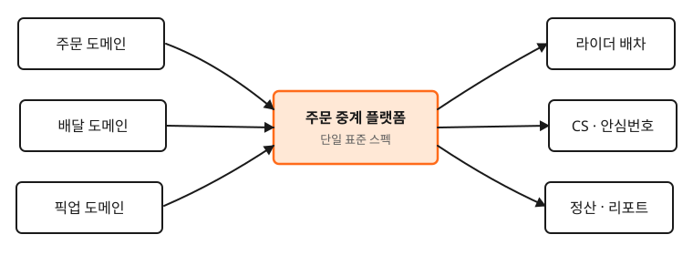

이 글은 Writing 인프라 검증용 샘플입니다. 실제 콘텐츠는 추후 직접 작성됩니다.

## 시작은 호텔이었다

호텔 IT 운영을 하던 시절, 처음으로 시스템과 시스템 사이의 데이터 흐름을 다뤘습니다. POS와 부킹 시스템 사이의 데이터가 끊어지는 곳을 메우는 일이 곧 PM의 일이라는 사실을 그때는 몰랐습니다.

이런 식의 H2 섹션이 자연스럽게 구분되고, **굵은 글씨**와 *기울임*, `인라인 코드`도 디자인 토큰대로 렌더됩니다.

## 도식 임베드 예시

마크다운에 Excalidraw export(SVG/PNG)를 이렇게 임베드하면, Astro가 자동으로 최적화·lazy load·width 추론을 처리하고, rehype-figure 플러그인이 alt 텍스트를 figcaption으로 자동 변환합니다.

alt 텍스트가 자동으로 figcaption으로 들어가니, 캡션을 따로 HTML로 적을 필요가 없습니다.

### 작은 통찰들

- 비전공이라는 사실은 약점이 아니다
- 한 도메인의 깊은 경험은 다른 도메인의 PM 일에서 강점이 된다
- 13년이라는 시간은 결국 누적되는 패턴 인식이다

### 인용

> 좋은 PM은 답을 잘 내는 사람이 아니라, "왜 이걸 해야 하는가"라는 질문을 끈질기게 던지는 사람이라는 것을 일하면서 깨달았습니다.

링크는 [이렇게](https://productmanager-olivia.com) 본문 안에 자연스럽게 들어옵니다.

## 마무리

본격적인 콘텐츠는 추후 추가됩니다. 이 글은 prose 스타일과 라우팅이 정상 작동하는지 확인하기 위한 스캐폴드입니다.
